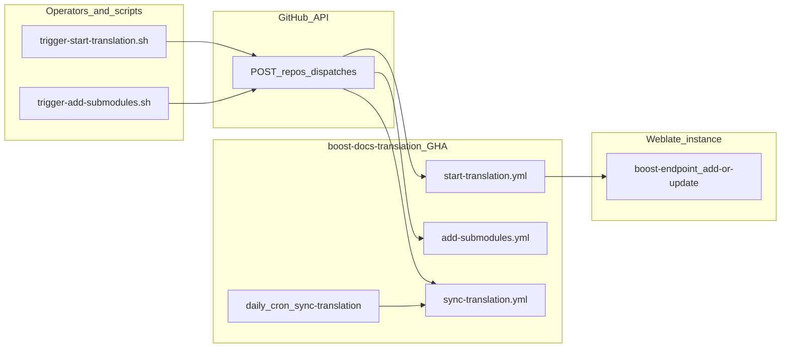

# Endpoint contract

**Status:** Operator-facing contract; per-surface labels: **documented** (caller + server checked), **partial** (caller only or server only), **unknown** (not verified here). **Caller sections** for Weblate below match **`start-translation.yml`** as of this doc (HTTP **202**/**200**, **120s** `curl` timeout, response bodies logged).

**Repos:** caller = this repo (`boost-docs-translation`); Weblate server implementation = [`cppalliance/weblate`](https://github.com/cppalliance/weblate) (`weblate.boost_endpoint` Django app). Anyone can verify the server sections against that public repository; file paths below are relative to its root.

## Overview and system boundary

This integration touches:

1. **GitHub** — `POST /repos/{owner}/{repo}/dispatches` to trigger workflows (operators or helper scripts); **`sync-translation`** also runs on a **daily schedule**.
2. **Weblate** — `POST …/boost-endpoint/add-or-update/` from `start-translation.yml` after submodule sync. The server typically responds quickly with **HTTP 202** (async processing); the workflow waits up to **120s**, checks the status code, and logs the response body on success or failure.

---

## Endpoint inventory

| #   | Surface                  | Method       | Path / URL                                               | Caller in this repo                                                                                     | Label                                         |
| --- | ------------------------ | ------------ | -------------------------------------------------------- | ------------------------------------------------------------------------------------------------------- | --------------------------------------------- |
| 1   | GitHub Actions           | `POST`       | `https://api.github.com/repos/{owner}/{repo}/dispatches` | `scripts/trigger-start-translation.sh`, `scripts/trigger-add-submodules.sh`                             | **documented**                                |
| 2   | GitHub Actions           | `POST`       | same as (1)                                              | `sync-translation`: manual dispatch or external automation — **no** `scripts/trigger-*.sh` in this repo | **partial**                                   |
| 3   | GitHub Actions           | _(schedule)_ | _(same workflow as row 2)_                               | `sync-translation.yml` — cron `0 0 * * *` (daily UTC)                                                   | **partial** (no dispatch URL; runs in GitHub) |
| 4   | Weblate `boost_endpoint` | `POST`       | `{WEBLATE_URL}/boost-endpoint/add-or-update/`            | `.github/workflows/start-translation.yml` (`trigger_weblate`)                                           | **documented**                                |
| 5   | Weblate `boost_endpoint` | `GET`        | `{WEBLATE_URL}/boost-endpoint/`                          | _Not called by this repo_                                                                               | **partial** (server only)                     |

`WEBLATE_URL` is a repository secret; the workflow strips a trailing slash before appending `/boost-endpoint/add-or-update/`. It must be the **HTTP origin** your instance uses for the UI/API (scheme + host + optional port). If the deployment serves Weblate under a path prefix (`settings.URL_PREFIX` in `weblate/urls.py`), include that prefix in `WEBLATE_URL` so resolved paths match the running site.

---

## 1. GitHub `repository_dispatch` (`POST …/dispatches`)

**Purpose:** Trigger a workflow in this repository via the [GitHub dispatches API](https://docs.github.com/en/rest/repos/repos#create-a-repository-dispatch-event).

### Common contract (helper scripts)

| Item              | Value                                                                                                          |
| ----------------- | -------------------------------------------------------------------------------------------------------------- |
| URL               | `https://api.github.com/repos/{owner}/{repo}/dispatches`                                                       |
| Method            | `POST`                                                                                                         |
| Auth              | `Authorization: Bearer {PAT}` (scripts use `GH_TOKEN` / `GITHUB_TOKEN` / `--token`)                            |
| Headers           | `Accept: application/vnd.github+json`, `X-GitHub-Api-Version: 2022-11-28`, `Content-Type: application/json`    |
| Success           | HTTP **204** (scripts treat only `204` as success and print the response body on failure)                      |
| Caller validation | Scripts capture HTTP status; they do **not** parse a success JSON body (GitHub returns empty body on success). |

### `event_type: add-submodules`

| Item             | Detail                                                                                                                |
| ---------------- | --------------------------------------------------------------------------------------------------------------------- |
| Workflow         | `.github/workflows/add-submodules.yml`                                                                                |
| Body shape       | `{"event_type":"add-submodules","client_payload":{...}}`                                                              |
| `client_payload` | All optional: `version`, `submodules` (list-like string), `lang_codes` (comma-separated). See [README](../README.md). |
| Script           | `scripts/trigger-add-submodules.sh` builds JSON with `jq` or Python; omits empty optional fields.                     |

### `event_type: start-translation`

| Item             | Detail                                                                       |
| ---------------- | ---------------------------------------------------------------------------- |
| Workflow         | `.github/workflows/start-translation.yml`                                    |
| Body shape       | `{"event_type":"start-translation","client_payload":{...}}`                  |
| `client_payload` | Optional: `version`, `lang_codes`, `extensions`. See [README](../README.md). |
| Script           | `scripts/trigger-start-translation.sh`                                       |

### `event_type: sync-translation`

| Item           | Detail                                                                                                                                                  |
| -------------- | ------------------------------------------------------------------------------------------------------------------------------------------------------- |
| Workflow       | `.github/workflows/sync-translation.yml`                                                                                                                |
| Triggers       | `repository_dispatch` **or** schedule **`0 0 * * *`** (daily, UTC).                                                                                     |
| Body shape     | `{"event_type":"sync-translation"}` (no `client_payload`)                                                                                               |
| Script in repo | **None** — for manual runs, operators call the dispatches API (or use the GitHub UI). Scheduled runs need no dispatch. Header example in workflow file. |

---

## 2. Weblate `POST …/boost-endpoint/add-or-update/`

**Purpose:** Tell the Weblate fork to add/update Boost doc components for a set of languages and submodule names.

### Caller contract (`start-translation.yml`)

| Item                 | Value                                                                                                                                                                               |
| -------------------- | ----------------------------------------------------------------------------------------------------------------------------------------------------------------------------------- |
| URL                  | `${WEBLATE_URL%/}/boost-endpoint/add-or-update/`                                                                                                                                    |
| Method               | `POST`                                                                                                                                                                              |
| Headers              | `Authorization: Token {WEBLATE_TOKEN}`, `Content-Type: application/json`, `User-Agent: BoostDocsSync/1.0`                                                                           |
| Body (JSON)          | `organization` (string), `add_or_update` (object: language code → array of submodule name strings), `version` (string), `extensions` (JSON array of extension strings, may be `[]`) |
| `organization` value | `MODULE_ORG` from `.github/workflows/assets/env.sh`: repository variable `SUBMODULES_ORG` if set, else GitHub org of this repo (`GITHUB_REPOSITORY` owner).                         |
| Timeout              | `curl --max-time 120` (120 seconds wall time for the full request/response)                                                                                                         |
| Success              | HTTP **202** — workflow logs “async” and pretty-prints JSON from the response body (`jq`). HTTP **200** — also treated as success (“sync server”); body printed to logs.            |
| Failure              | Any HTTP status other than **202** or **200**, or non-zero `curl` exit (includes timeouts). Response body is printed to the log when captured.                                      |

**Residual risk:** A **slow** server may hold the job for up to **120s** before failing; operators should watch Actions logs for Weblate errors even when HTTP status is success (async work continues on the server after **202**).

### When the POST is skipped

If `add_or_update` would serialize to `{}` (no submodules produced updates for any language), `trigger_weblate` returns without calling Weblate (`weblate.boost_endpoint` serializer also rejects an empty map — see server section).

### Server contract (`cppalliance/weblate`)

The following matches the published [`cppalliance/weblate`](https://github.com/cppalliance/weblate) sources (`weblate.boost_endpoint`). Paths in the table are relative to that repository’s root (browse on GitHub or clone locally):

| Item               | Value                                                                                                                                                                                                                                                                                                                                       |
| ------------------ | ------------------------------------------------------------------------------------------------------------------------------------------------------------------------------------------------------------------------------------------------------------------------------------------------------------------------------------------- |
| Mount              | `path("boost-endpoint/", include("weblate.boost_endpoint.urls"))` when `weblate.boost_endpoint` is in `INSTALLED_APPS` (`weblate/urls.py`, appended to `real_patterns`).                                                                                                                                                                    |
| POST route         | `add-or-update/` → `AddOrUpdateView`                                                                                                                                                                                                                                                                                                        |
| Auth               | `IsAuthenticated` (DRF). Token style used by caller matches typical Weblate/API token usage.                                                                                                                                                                                                                                                |
| Request schema     | `AddOrUpdateRequestSerializer`: `organization` (required string), `add_or_update` (required dict, **non-empty**, values are lists of strings), `version` (required string), `extensions` (optional list of strings or null).                                                                                                                |
| Success            | Typical: HTTP **202** with JSON body (async accept — e.g. task metadata). Compatible: HTTP **200** with JSON body (synchronous per-`lang_code` result map from `BoostComponentService.process_all`). Exact shapes depend on fork version; compare [`cppalliance/weblate`](https://github.com/cppalliance/weblate) `weblate.boost_endpoint`. |
| Validation failure | HTTP **400** with `{"errors": …}`                                                                                                                                                                                                                                                                                                           |
| Server error       | HTTP **500** with `{"error": "<message>"}`                                                                                                                                                                                                                                                                                                  |

**Alignment:** Caller JSON keys `organization`, `add_or_update`, `version`, `extensions` match serializer field names. Submodule lists are JSON arrays of strings, as expected.

---

## 3. Weblate `GET …/boost-endpoint/` (informational)

**Server:** `BoostEndpointInfo` — returns JSON `{"module":"boost-endpoint","description":"Boost documentation translation API"}` (fixed strings in `views.py`).

**This repo:** No workflow or script calls this endpoint today. Useful for manual health checks with the same token as the POST.

**Label:** **partial** (documented server behavior only).

---

## Error handling and observability gaps

| Gap                                                      | Impact                                                                                 |
| -------------------------------------------------------- | -------------------------------------------------------------------------------------- |
| Async **202** success does not imply components finished | Operators must rely on Weblate/UI or server logs for processing failures after accept. |
| Long blocking wait (up to **120s**)                      | Failed or slow Weblate ties up the Actions step until timeout.                         |
| No in-repo script for `sync-translation`                 | Easy to mistype manual dispatch JSON or target repo (scheduled runs avoid this).       |

---

## Open questions / backlog

| Item                          | Notes                                                                                                                       |
| ----------------------------- | --------------------------------------------------------------------------------------------------------------------------- |
| `GET /boost-endpoint/`        | Decide if CI should probe it before POST (out of scope for this doc pass).                                                  |
| Other `boost_endpoint` routes | Only `""` and `add-or-update/` under app `urls.py` today; re-check if fork adds CI hooks.                                   |
| Auth details                  | Confirm token type (Weblate user token vs project token) in deployment docs.                                                |
| Retry policy                  | No retries in workflow; document any future retry/idempotency expectations with server owners.                              |
| `sync-translation` helper     | Optional: add `scripts/trigger-sync-translation.sh` mirroring other triggers (schedule already covers unattended roll-ups). |

---

## Source index (this repo)

| Topic                                    | File                                                          |
| ---------------------------------------- | ------------------------------------------------------------- |
| Weblate POST                             | `.github/workflows/start-translation.yml` (`trigger_weblate`) |
| `sync-translation` (dispatch + schedule) | `.github/workflows/sync-translation.yml`                      |
| `MODULE_ORG` / `organization`            | `.github/workflows/assets/env.sh`                             |
| Dispatch: start                          | `scripts/trigger-start-translation.sh`                        |
| Dispatch: add-submodules                 | `scripts/trigger-add-submodules.sh`                           |
| Workflow triggers & payload tables       | `README.md`                                                   |

## Source index (Weblate fork)

| Topic              | Path in `cppalliance/weblate`                                              |
| ------------------ | -------------------------------------------------------------------------- |
| Mount              | `weblate/urls.py` (`boost-endpoint/`)                                      |
| Routes             | `weblate/boost_endpoint/urls.py`                                           |
| POST handler       | `weblate/boost_endpoint/views.py` (`AddOrUpdateView`, `BoostEndpointInfo`) |
| Request validation | `weblate/boost_endpoint/serializers.py`                                    |
| Component logic    | `weblate/boost_endpoint/services.py` (`BoostComponentService.process_all`) |
